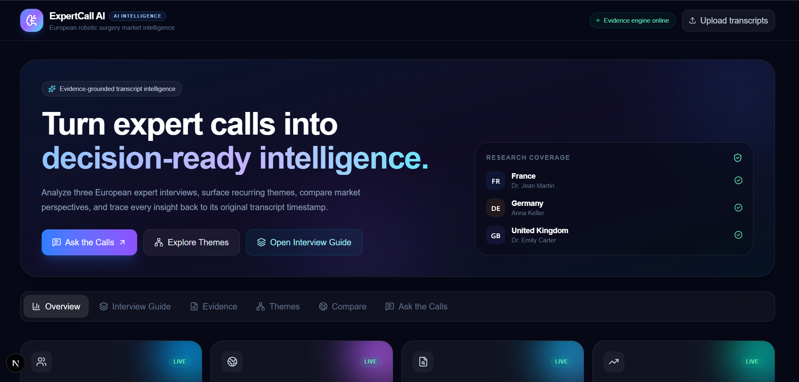
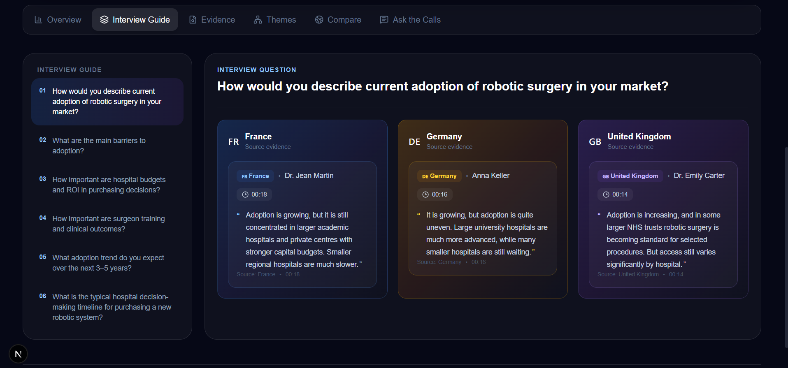
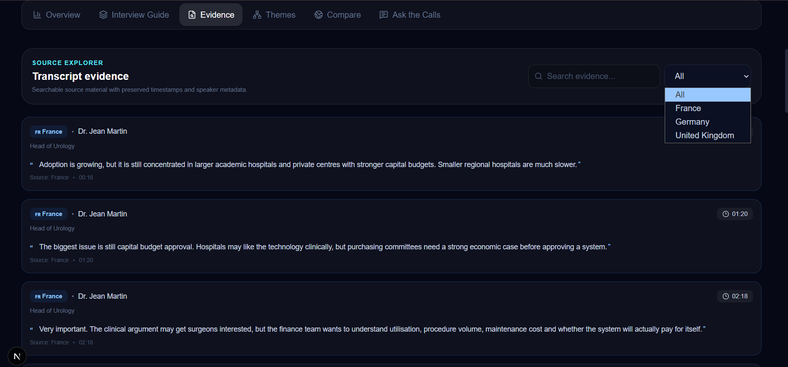
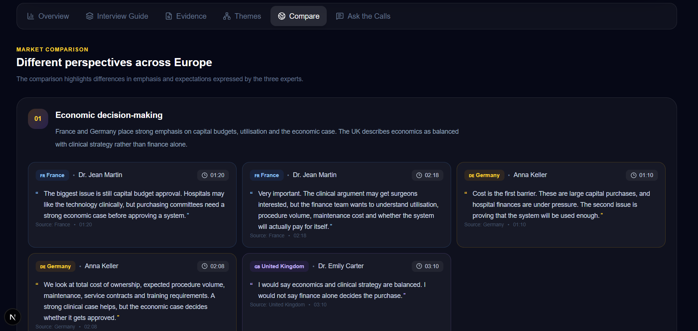
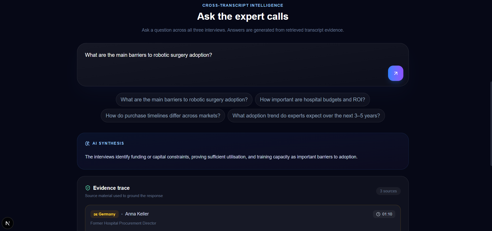
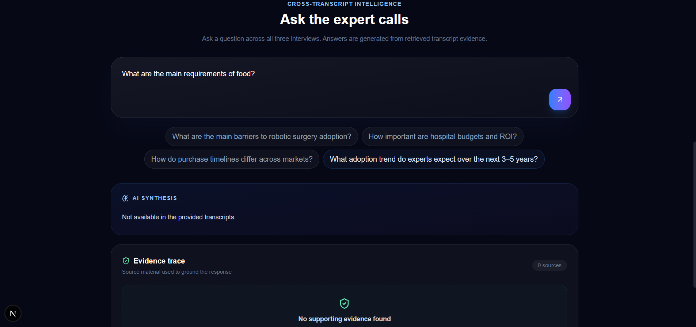

# ExpertCall AI

## European Robotic Surgery Market Intelligence

An evidence-grounded AI application for analyzing expert-call transcripts, extracting interview-guide answers, identifying common themes and differences across markets, and answering questions with traceable transcript evidence.

Built as an AI Engineer technical case study for Hasamex.

---

## Application Preview

### Overview



*Overview dashboard showing the three expert interviews, markets covered, and the main analysis areas.*

---

### Interview Guide



*Interview Guide view providing transcript-grounded answers to the case-study questions for individual experts.*

---

### Evidence Explorer



*Evidence Explorer showing the original expert statement together with the expert, market, and source timestamp.*

---

### Cross-Market Themes


*Themes view showing recurring evidence-backed themes identified across the three expert interviews.*

---

### Cross-Market Comparison



*Comparison view showing differences in economic decision-making, training and utilisation, adoption expectations, and purchasing timelines.*

---

### Ask the Calls



*Ask the Calls interface allowing users to ask questions across all three transcripts and inspect the evidence supporting the answer.*

---

### Hallucination Protection Test



*Unsupported-question test demonstrating that the application does not fabricate information when the requested evidence is not available in the supplied transcripts.*

---

# 1. Problem Statement

The case study focuses on understanding hospital adoption, barriers, economics, and purchasing behaviour for robotic surgery systems in Europe.

The application analyzes three expert-call transcripts covering:

- France
- Germany
- United Kingdom

The goal is to make qualitative expert-call analysis faster while keeping every important conclusion traceable to the original transcript evidence.

---

# 2. Case Study Questions

The application analyzes the six interview-guide questions provided in the case:

1. How would you describe current adoption of robotic surgery in your market?

2. What are the main barriers to adoption?

3. How important are hospital budgets and ROI in purchasing decisions?

4. How important are surgeon training and clinical outcomes?

5. What adoption trend do you expect over the next 3–5 years?

6. What is the typical hospital decision-making timeline for purchasing a new robotic system?

---

# 3. Expert Interviews

| Expert | Role | Market |
|---|---|---|
| Dr. Jean Martin | Head of Urology | France |
| Anna Keller | Former Hospital Procurement Director | Germany |
| Dr. Emily Carter | Consultant Urologist | United Kingdom |

The application preserves the expert, role, market, speaker, timestamp, and original transcript statement for each transcript segment.

---

# 4. Key Features

## Interview Guide Analysis

The application provides answers to the six case-study questions for each expert.

Each answer can be traced back to supporting transcript evidence.

The system preserves:

- Expert
- Role
- Market
- Speaker
- Timestamp
- Original transcript statement

---

## Evidence Explorer

The Evidence Explorer provides access to the transcript statements used to support analysis.

Each evidence item contains:

- Expert
- Role
- Market
- Speaker
- Timestamp
- Original statement

This allows a reviewer to move from an analytical conclusion back to the source evidence.

---

## Cross-Market Themes

The application identifies recurring themes across the three interviews.

Current themes include:

### Growing but uneven adoption

All three experts describe robotic surgery adoption as increasing while also describing variation across hospitals.

### Economics and capital approval

Capital budgets, cost, ROI, utilisation, maintenance, and the economic case repeatedly appear in purchasing discussions.

### Training and utilisation

The interviews connect training capacity with the ability to achieve sufficient utilisation of a robotic system.

### Procedure volume and programme sustainability

Procedure volume and utilisation are linked to whether a robotic surgery programme can operate sustainably.

---

## Cross-Market Comparison

The comparison view focuses on four areas:

- Economic decision-making
- Training and utilisation
- Expected adoption trend
- Purchase decision timeline

The application presents the supporting transcript evidence for each comparison.

---

## Ask the Calls

Users can ask questions across all three expert transcripts.

Example:

```text
What are the main barriers to robotic surgery adoption?

5. Evidence-Grounded Architecture

Evidence-grounded RAG architecture showing how transcript statements are transformed into traceable AI-generated analysis.

Expert Transcripts
        |
        v
Transcript Parser
        |
        v
Timestamp + Speaker Metadata
        |
        v
Expert Statements
        |
        v
Gemini Embeddings
        |
        v
FAISS Vector Index
        |
        v
User Question
        |
        v
Question Classification
        |
        v
Evidence Retrieval
        |
        v
Evidence Filtering
        |
        v
Gemini Synthesis
        |
        +----------------------+
        |                      |
        v                      v
   AI Synthesis          Original Evidence
                         + Timestamp
6. Technical Approach
6.1 Transcript Ingestion

The application reads the expert transcripts and converts timestamped transcript lines into structured transcript segments.

Each segment contains:

id
expert
role
market
speaker
timestamp
text

This metadata is preserved throughout the retrieval and response process.

6.2 Speaker-Aware Retrieval

Only expert statements are included in the searchable evidence index.

Interviewer statements are excluded.

This prevents interviewer questions from being incorrectly returned as evidence.

For example:

01:20 Dr. Martin:
The biggest issue is still capital budget approval.

can be used as evidence.

Whereas:

01:12 Interviewer:
So ROI is important?

is not indexed as expert evidence.

6.3 Embeddings

Transcript segments are converted into vector embeddings using:

gemini-embedding-001

The embeddings represent the semantic meaning of each expert statement.

6.4 Vector Search

FAISS is used for local vector similarity search.

When the user asks a question, the question is converted into an embedding and compared against the transcript embeddings.

The most relevant expert statements are retrieved as candidate evidence.

6.5 Question Classification

The system identifies the type of question before selecting evidence.

Supported categories include:

Adoption
Barriers
Economics / ROI
Training
Trends
Purchase timelines
General transcript questions

Unsupported questions requesting information such as market size, revenue, CAGR, installed base, or other information not contained in the transcripts are handled as unavailable.

6.6 Evidence Filtering

Retrieved candidates are filtered according to the question type.

This helps remove semantically similar but contextually irrelevant transcript statements before the LLM receives the evidence.

6.7 LLM Synthesis

Gemini receives the selected transcript evidence and produces the answer.

The LLM is instructed to:

use only supplied evidence
avoid outside knowledge
preserve uncertainty
avoid unsupported facts
avoid fabricated statistics
avoid fabricated quotes
avoid fabricated timestamps
6.8 Evidence Trace

The application returns evidence metadata separately from the generated synthesis.

The exact quotation shown in the UI comes from the original transcript segment.

The timestamp also comes directly from the transcript metadata.

Therefore, the LLM does not generate the source citation information.

7. Hallucination Mitigation

Hallucination control is a core design requirement.

The system uses multiple safeguards.

1. Transcript as the source of truth

The original transcript remains the authoritative source for the analysis.

The LLM is used for synthesis rather than as a source of external facts.

2. Evidence-grounded generation

The model receives retrieved transcript evidence as its context.

3. Interviewer exclusion

Interviewer statements are excluded from the retrieval index.

4. Original quotes

Exact quotes are taken from the original transcript records.

They are not generated by the LLM.

5. Original timestamps

Timestamps are stored as transcript metadata and returned from the source segment.

6. Unsupported-question handling

If the supplied transcripts do not contain sufficient evidence, the application returns:

Not available in the provided transcripts.
7. Expert uncertainty preservation

Statements such as:

I expect...
I would expect...
I think...
I could see...

are treated as expert expectations rather than independently verified market forecasts.

8. Example Analysis
Adoption

All three experts describe robotic surgery adoption as increasing.

At the same time, the interviews describe adoption as uneven across hospitals, with larger academic, university, private, or NHS centres generally further ahead than smaller hospitals.

Economics and ROI

The France and Germany interviews place strong emphasis on capital approval and the economic case.

The UK interview describes economics as important but balances financial considerations with clinical strategy, patient outcomes, length of stay, and surgeon recruitment.

These observations represent the supplied expert perspectives.

Training and Utilisation

Training is repeatedly connected to utilisation.

The interviews indicate that purchasing a robotic system without enough trained users can make it difficult to achieve sufficient utilisation.

The UK interview additionally highlights theatre staff training.

Expected Adoption Trends

The experts provide different expectations.

France

Dr. Martin expects adoption to continue increasing steadily rather than explosively.

He mentions potentially 15–20% more procedures annually in some stronger centres.

Germany

Anna Keller expects gradual growth.

She describes high single-digit or low double-digit procedure-volume growth rather than 20% across the whole market.

United Kingdom

Dr. Carter is positive about potential acceleration if training expands and systems become more cost competitive.

She says procedure growth could exceed 15% annually in some areas.

These are expert expectations from the supplied interviews, not independently verified market forecasts.

9. Purchase Decision Timelines

The interviews provide the following stated timelines:

Market	Stated timeline
France	6–12 months is described as realistic once the hospital becomes serious. It can take longer if the purchase moves into the next budget cycle.
Germany	9–18 months is described as common because procurement, clinical leadership, finance, and management need to align.
United Kingdom	Around 6–9 months can happen when funding is already available. A new capital cycle can take much longer.

These figures are taken from the supplied expert interviews.

10. Technology Stack
Frontend
Next.js
React
TypeScript
Tailwind CSS
Lucide React
Backend
Python
FastAPI
Pydantic
Uvicorn
AI and Retrieval
Google Gemini
Gemini Embeddings
gemini-embedding-001
Gemini Flash
FAISS
NumPy
11. Project Structure
HasamexExpertCallAI/
│
├── backend/
│   ├── app/
│   │   ├── models/
│   │   └── services/
│   ├── main.py
│   └── requirements.txt
│
├── frontend/
│   ├── app/
│   │   ├── globals.css
│   │   ├── layout.tsx
│   │   └── page.tsx
│   ├── public/
│   ├── package.json
│   ├── package-lock.json
│   └── ...
│
├── transcripts/
│
├── docs/
│   └── images/
│       ├── overview.png
│       ├── interview-guide.png
│       ├── evidence.png
│       ├── themes.png
│       ├── compare.png
│       ├── ask-the-calls.png
│       ├── hallucination-test.png
│       └── architecture.png
│
├── README.md
└── .gitignore
12. Running Locally
Prerequisites
Python 3.12+
Node.js
npm
Gemini API key
Backend Setup

Open PowerShell:

cd C:\Projects\HasamexExpertCallAI\backend

Activate the virtual environment:

.\venv\Scripts\Activate.ps1

Set the Gemini API key:

$env:GEMINI_API_KEY="YOUR_GEMINI_API_KEY"

Verify the key is configured:

python -c "import os; print('Gemini key configured:', bool(os.getenv('GEMINI_API_KEY')))"

Expected output:

Gemini key configured: True

Start the backend:

python -m uvicorn main:app --reload

The backend will run at:

http://127.0.0.1:8000

FastAPI documentation:

http://127.0.0.1:8000/docs
Frontend Setup

Open a second PowerShell window:

cd C:\Projects\HasamexExpertCallAI\frontend

Install dependencies:

npm install

Start the development server:

npm run dev

Open:

http://localhost:3000
13. API Endpoints

The backend exposes the following endpoints:

Endpoint	Purpose
GET /	API health/status
GET /api/experts	List experts
GET /api/transcripts	Retrieve transcript evidence
GET /api/guide	Interview-guide analysis
GET /api/themes	Cross-transcript themes
GET /api/differences	Cross-market comparisons
POST /api/ask	Ask questions across transcripts
POST /api/upload	Upload and activate three transcripts
14. Transcript Upload

The application supports uploading three .txt expert transcripts.

The expected transcript structure is:

Expert: Expert Name
Role: Expert Role
Market: France

00:00 Interviewer: ...
00:18 Expert Name: ...
01:20 Expert Name: ...

The current validation requires:

Exactly 3 transcripts
France
Germany
United Kingdom
Expert metadata
Timestamped transcript segments
Expert evidence for each required market
15. Scaling the Solution

The current implementation is intentionally lightweight and suitable for a three-transcript case study.

The architecture can be extended from:

3 transcripts

to:

30+ transcripts

without changing the fundamental retrieval architecture.

Current case-study architecture
Local transcript data
        ↓
Gemini embeddings
        ↓
FAISS
        ↓
Evidence filtering
        ↓
Gemini synthesis
Production-scale architecture

A production implementation could introduce:

Object Storage
      ↓
Async Ingestion Pipeline
      ↓
Transcript Parser
      ↓
Chunking + Metadata
      ↓
Embedding Service
      ↓
Production Vector Database
      ↓
Hybrid Retrieval
      ↓
Reranking
      ↓
Evidence Validation
      ↓
LLM Synthesis
      ↓
Citations + Audit Trail

For larger datasets, additional improvements could include:

persistent document storage
asynchronous ingestion
hybrid keyword + semantic retrieval
metadata filtering
reranking
caching
batch embedding
evaluation pipelines
observability
access control
audit logging
16. Evaluation Strategy

A transcript intelligence system should be evaluated not only on whether an answer sounds reasonable, but also on whether the answer is supported by the source.

Example evaluation dimensions:

Dimension	Evaluation
Answer accuracy	Does the answer reflect the transcript?
Evidence relevance	Does the cited statement support the answer?
Quote accuracy	Is the quote copied from the transcript?
Timestamp accuracy	Does the timestamp match the source?
Source attribution	Is the correct expert identified?
Hallucination resistance	Does the system reject unsupported questions?
Cross-market consistency	Are comparisons supported by evidence?

Example test questions:

What are the main barriers to robotic surgery adoption?
How do the purchase timelines differ across the three markets?
How important is ROI?
What role does training play in utilisation?
What is the total European robotic surgery market size in 2026?

The final question should not be answered using external assumptions because the supplied transcripts do not contain that information.

Expected response:

Not available in the provided transcripts.
17. Design Decisions
Why RAG?

The primary requirement is traceability.

A retrieval-based architecture allows the application to retrieve the relevant transcript evidence before asking the LLM to synthesize an answer.

Why FAISS?

FAISS provides lightweight local vector search and is sufficient for the three-transcript case study.

It also provides a straightforward path toward replacing the local index with a production vector database at larger scale.

Why separate evidence from synthesis?

The LLM should not be responsible for creating source metadata.

The application retrieves the original transcript segment and returns:

Expert
Market
Timestamp
Original statement

separately from the generated synthesis.

This reduces the risk of fabricated citations and timestamps.

Why exclude interviewer statements?

The case requires analysis of expert perspectives.

Indexing interviewer questions could cause retrieval to return questions instead of expert evidence.

Therefore, interviewer statements are excluded from the searchable evidence index.

18. Limitations

The current implementation is designed for the provided case-study dataset.

Current limitations include:

Local FAISS index
In-memory runtime dataset
Three-transcript upload validation
.txt transcript input
No persistent production database
No authentication
No production-scale observability
No external market-data integration
Upload analysis assumes the case-study transcript structure and required markets

These limitations are appropriate for a focused technical case-study implementation and can be addressed in a production architecture.

19. Security

API keys should never be committed to source control.

Use an environment variable:

GEMINI_API_KEY

Do not place secrets in:

source code
README
screenshots
GitHub commits
frontend code

The repository includes .gitignore rules for environment files and generated dependencies.

20. Demo Flow

A concise demonstration can follow this sequence:

1. Problem

Explain that the application analyzes three expert calls across France, Germany, and the UK.

2. Architecture

Show the transcript → embedding → retrieval → evidence filtering → LLM synthesis pipeline.

3. Interview Guide

Demonstrate one of the six case-study questions.

4. Evidence

Show the exact expert statement and timestamp supporting the answer.

5. Themes

Show recurring themes across the three markets.

6. Compare

Show economic decision-making, training, adoption expectations, and purchasing timelines.

7. Ask the Calls

Ask:

What are the main barriers to robotic surgery adoption?

Show the generated synthesis and evidence trace.

8. Hallucination Test

Ask:

What is the total European robotic surgery market size in 2026?

Show:

Not available in the provided transcripts.
9. Scaling

Explain how the architecture could scale from three transcripts to 30+ transcripts using persistent storage, production vector search, metadata filtering, reranking, and asynchronous ingestion.

21. Core Design Principle

The most important design decision in ExpertCall AI is the separation between evidence retrieval and LLM synthesis.

Transcript
    ↓
Evidence
    ↓
LLM synthesis
    ↓
Answer

not:

LLM
    ↓
Generated answer
    ↓
Generated citation

The transcript remains the source of truth.

The LLM synthesizes retrieved evidence.

Quotes and timestamps are taken from the original transcript records.

When evidence is unavailable, the application explicitly states:

Not available in the provided transcripts.

This creates a more traceable and auditable approach to expert-call transcript intelligence.

22. Case Study Deliverables

The repository contains:

Working frontend application
FastAPI backend
Transcript analysis pipeline
Vector retrieval using FAISS
Gemini-based embeddings
Gemini-based synthesis
Interview-guide analysis
Evidence explorer
Cross-market themes
Cross-market comparison
Cross-transcript Q&A
Hallucination mitigation
Local setup instructions
Scaling approach
Evaluation strategy