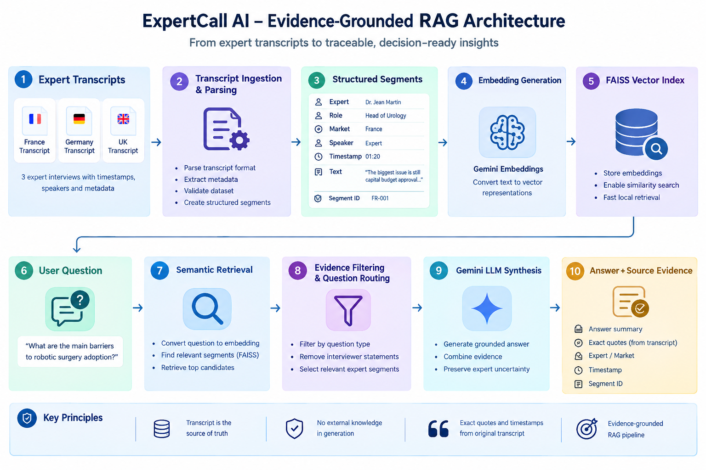

# ExpertCall AI – European Robotic Surgery Market Intelligence

> An evidence-grounded AI application for analysing expert interviews, extracting decision-ready insights, comparing market perspectives, and tracing every insight back to the original transcript timestamp.

---

## Application Preview

### Overview


*Overview dashboard showing the three expert interviews, markets covered, and the main analysis areas.*

### Interview Guide


*Interview Guide view providing transcript-grounded answers to the case-study questions for individual experts.*

### Evidence Explorer


*Evidence Explorer showing the original expert statement together with the expert, market, and source timestamp.*

### Themes


*Cross-transcript themes supported by evidence from multiple expert interviews.*

### Cross-Market Comparison


*Comparison of economic decision-making, training and utilisation, adoption trends, and purchase decision timelines across France, Germany, and the UK.*

### Ask the Calls


*Natural-language question answering across all three expert transcripts with an evidence trace.*

### Hallucination Test


*Example of the system refusing to provide unsupported market information when the answer is not present in the supplied transcripts.*

### Architecture



*Evidence-grounded RAG architecture used by the application.*

---

## Problem Statement

The case study focuses on understanding hospital adoption, barriers, economics, and purchasing behaviour for robotic surgery systems in Europe.

The application analyses three expert-call transcripts from:

- France
- Germany
- United Kingdom

The system answers the six interview-guide questions for each expert, extracts supporting quotes, preserves source timestamps, identifies common themes and differences, and allows users to ask additional questions across all transcripts.

The core requirement is that important insights remain traceable to the original transcript evidence.

---

## Case Study Questions

The application analyses the following interview-guide questions:

1. How would you describe current adoption of robotic surgery in your market?
2. What are the main barriers to adoption?
3. How important are hospital budgets and ROI in purchasing decisions?
4. How important are surgeon training and clinical outcomes?
5. What adoption trend do you expect over the next 3–5 years?
6. What is the typical hospital decision-making timeline for purchasing a new robotic system?

---

## Expert Interviews

| Expert | Role | Market |
|---|---|---|
| Dr. Jean Martin | Head of Urology | France |
| Anna Keller | Former Hospital Procurement Director | Germany |
| Dr. Emily Carter | Consultant Urologist | United Kingdom |

The application preserves expert, role, market, speaker, timestamp, and original transcript text for every segment.

---

# Key Features

## 1. Transcript Ingestion

The application supports uploading three `.txt` expert transcripts.

Each transcript contains:

- Expert name
- Role
- Market
- Timestamp
- Speaker
- Original statement

The parser validates the uploaded dataset and requires:

- Exactly three transcripts
- France
- Germany
- United Kingdom
- Expert statements for every market

---

## 2. Interview Guide Analysis

For each expert, the application provides answers to the six case-study questions.

Answers are generated using retrieved transcript evidence rather than unrestricted model generation.

Each answer can be traced to supporting transcript statements.

---

## 3. Evidence Explorer

The Evidence tab provides access to the underlying transcript evidence.

Each evidence record contains:

- Expert
- Role
- Market
- Speaker
- Timestamp
- Original quote
- Segment ID

The original transcript remains the source of truth.

---

## 4. Evidence-Grounded Themes

The application identifies recurring themes across the interviews.

### Growing but Uneven Adoption

All three experts describe robotic surgery adoption as increasing while noting differences between hospitals.

### Economics and Capital Approval

Capital budgets, cost, ROI, utilisation, maintenance, and the economic case repeatedly appear in purchasing discussions.

### Training and Utilisation

The experts connect training capacity with the ability to use a robotic system sufficiently.

### Procedure Volume and Programme Sustainability

Procedure volume and utilisation are linked to whether a robotic surgery programme can operate sustainably.

Every theme is supported by transcript evidence.

---

# Cross-Market Comparison

The Compare tab focuses on four evidence-backed comparison areas.

## Economic Decision-Making

### France

Dr. Martin states that capital budget approval is a major barrier and that purchasing committees require a strong economic case.

**Source:** Dr. Jean Martin — `01:20`

He also highlights utilisation, procedure volume, maintenance cost, and whether the system will pay for itself.

**Source:** Dr. Jean Martin — `02:18`

### Germany

Anna Keller identifies cost and hospital financial pressure as major barriers.

**Source:** Anna Keller — `01:10`

She explains that procurement evaluates total cost of ownership, procedure volume, maintenance, service contracts, and training requirements.

**Source:** Anna Keller — `02:08`

### United Kingdom

Dr. Carter states that ROI matters, but purchasing decisions also consider patient outcomes, length of stay, surgeon recruitment, and clinical positioning.

**Source:** Dr. Emily Carter — `02:07`

She describes economics and clinical strategy as balanced rather than finance alone determining the purchase.

**Source:** Dr. Emily Carter — `03:10`

---

## Training and Utilisation

Training is a recurring operational consideration.

In France, Dr. Martin explains that hospitals want several surgeons trained so that utilisation is high enough.

**Source:** Dr. Jean Martin — `03:10`

In Germany, Anna Keller states that if only one surgeon is comfortable using the system, utilisation will be poor and the business case becomes weaker.

**Source:** Anna Keller — `03:05`

In the UK, Dr. Carter identifies training capacity as equally important to funding and states that adoption can stall when enough surgeons and theatre staff cannot be trained.

**Source:** Dr. Emily Carter — `01:05`

---

## Expected Adoption Trend

The three experts expect continued growth, but their expectations differ in emphasis.

### France

Dr. Martin expects adoption to continue increasing steadily rather than explosively. He mentions 15–20% more procedures annually in some stronger centres.

**Source:** Dr. Jean Martin — `05:07`

### Germany

Anna Keller expects gradual growth, describing high single digits or low double digits in procedure volumes rather than 20% across the whole market.

**Source:** Anna Keller — `05:08`

### United Kingdom

Dr. Carter is more positive about acceleration if training expands and systems become more cost competitive. She mentions procedure growth above 15% annually in some areas.

**Source:** Dr. Emily Carter — `04:06`

> These figures represent individual expert expectations from the supplied interviews. They are not independently verified market forecasts.

---

## Purchase Decision Timeline

### France

Approximately 6–12 months is described as realistic once the hospital becomes serious, with longer timelines possible when a purchase moves into another budget cycle.

**Source:** Dr. Jean Martin — `06:08`

### Germany

Nine to eighteen months is described as common because procurement, clinical leadership, finance, and management need to align.

**Source:** Anna Keller — `06:05`

### United Kingdom

Around six to nine months can occur when funding is already available, while a new capital cycle can extend the process.

**Source:** Dr. Emily Carter — `05:04`

---

## Summary of Differences

The application presents differences as evidence-backed variations in expert perspectives rather than inventing unsupported conclusions.

| Area | France | Germany | United Kingdom |
|---|---|---|---|
| Adoption | Growing steadily | Growing but uneven | Increasing; standard in some larger NHS trusts |
| Economics | Strong capital/ROI focus | Strong procurement/economic focus | Economics balanced with clinical strategy |
| Training | Important for utilisation | Important for utilisation | Major adoption constraint |
| Outlook | Steady growth | Gradual growth | Potential acceleration |
| Purchase timeline | 6–12 months | 9–18 months | 6–9 months if funding exists |

---

# Ask the Calls

The Ask the Calls feature allows the user to ask natural-language questions across all three transcripts.

Example:

> What are the main barriers to robotic surgery adoption?

The system retrieves relevant expert statements and generates a grounded synthesis.

Example answer:

> The interviews identify funding or capital constraints, proving sufficient utilisation, and training capacity as important barriers to adoption.

The response is accompanied by an evidence trace containing the supporting expert statements and timestamps.

---

# Evidence-Grounded Architecture


```text
                    Expert Transcripts
                           |
                           v
                  Transcript Ingestion
                           |
                           v
              Parsing + Metadata Preservation
                           |
                           v
                     Text Segments
                           |
                           v
                    Embeddings
                           |
                           v
                    FAISS Index
                           |
                    User Question
                           |
                           v
                      Retrieval
                           |
                           v
                 Evidence Filtering
                           |
                           v
                   Gemini LLM
                           |
                           v
              Grounded Answer Synthesis
                           |
              +------------+------------+
              |                         |
              v                         v
        Answer Summary          Evidence / Citations
                                      |
                                      v
                              Original Timestamp

# Technical Approach

## Frontend

- Next.js
- TypeScript
- Tailwind CSS
- Lucide React

The frontend provides the analysis interface and communicates with the FastAPI backend through REST APIs.

The UI is organized into six main analysis areas:

- Overview
- Interview Guide
- Evidence
- Themes
- Compare
- Ask the Calls

## Backend

- Python
- FastAPI
- Pydantic

The backend handles:

- Transcript parsing
- Transcript validation
- Timestamp and speaker metadata preservation
- Embedding generation
- Vector indexing
- Semantic retrieval
- Evidence filtering
- LLM-based answer synthesis
- Theme analysis
- Cross-market comparison
- Transcript upload and dataset activation

## Retrieval

The application uses a Retrieval-Augmented Generation (RAG) approach.

The transcript statements are converted into vector embeddings and indexed using FAISS.

When a user asks a question:

1. The question is converted into an embedding.
2. Relevant transcript segments are retrieved using vector similarity.
3. Retrieved segments are filtered based on the question type.
4. Relevant evidence is provided to the Gemini model.
5. Gemini generates a grounded synthesis.
6. The original transcript metadata is used to display the supporting evidence, expert, market, and timestamp.

Only expert statements are indexed for question answering. Interviewer statements are excluded from the retrieval corpus so that the model does not incorrectly use the interviewer's question as evidence.

## LLM

Gemini is used for synthesis after relevant transcript evidence has been retrieved.

The LLM is responsible for:

- Summarising expert statements
- Combining evidence across interviews
- Answering user questions using the supplied evidence
- Preserving uncertainty expressed by the experts

The model is not responsible for generating source timestamps or exact quotations.

## Evidence and Citation Handling

Each transcript segment is stored with:

- Segment ID
- Expert
- Role
- Market
- Speaker
- Timestamp
- Original transcript text

This metadata is preserved throughout the retrieval pipeline.

Exact quotations shown in the application are taken directly from the original transcript segment.

Timestamps are also taken directly from the transcript metadata.

This prevents the LLM from inventing quotations or timestamps.

## Hallucination Mitigation

The application uses multiple controls to reduce unsupported answers:

1. Answers are generated only from retrieved transcript evidence.
2. The LLM is instructed not to use external knowledge.
3. Exact quotes are taken from the original transcript rather than generated by the model.
4. Timestamps are taken from stored transcript metadata.
5. Interviewer statements are excluded from the evidence retrieval corpus.
6. Retrieved evidence is filtered according to the question type.
7. Expert expectations are preserved as expectations rather than presented as verified facts.
8. If the required information is not present in the transcripts, the system returns:

> Not available in the provided transcripts.

For example, the provided interviews do not contain a verified European robotic surgery market size. The application therefore does not fabricate a market-size figure.

## Cross-Market Analysis

The application compares the three expert perspectives across:

- Economic decision-making
- Training and utilisation
- Expected adoption trends
- Purchase decision timelines

Comparison evidence is linked to specific transcript segment IDs and timestamps.

The system presents differences as evidence-backed variations in expert perspectives rather than generating unsupported conclusions.

## Why FAISS?

FAISS provides lightweight local vector similarity search and is sufficient for the three-transcript case-study implementation.

For a larger production deployment, the local FAISS index could be replaced with a production vector database.

## Why RAG?

The case study requires answers to remain grounded in a limited set of source transcripts.

RAG provides a controlled workflow in which relevant source evidence is retrieved before the LLM generates the response.

The architecture separates:

- Retrieval
- Evidence validation
- Generation
- Source metadata

This makes the generated analysis more traceable and auditable.

---

# Example Analysis

## Question

> What are the main barriers to robotic surgery adoption?

## Grounded Synthesis

The interviews identify funding or capital constraints, proving sufficient utilisation, and training capacity as important barriers to adoption.

## Evidence

### Germany — Anna Keller — `01:10`

> Cost is the first barrier. These are large capital purchases, and hospital finances are under pressure. The second issue is proving that the system will be used enough.

### France — Dr. Jean Martin — `01:20`

> The biggest issue is still capital budget approval. Hospitals may like the technology clinically, but purchasing committees need a strong economic case before approving a system.

### United Kingdom — Dr. Emily Carter — `01:05`

> Funding is important, but I would say training capacity is just as important.

---

# Technology Stack

| Layer | Technology |
|---|---|
| Frontend | Next.js + TypeScript |
| Styling | Tailwind CSS |
| Backend | Python + FastAPI |
| Validation | Pydantic |
| LLM | Gemini |
| Embeddings | Gemini Embeddings |
| Vector Search | FAISS |
| API | REST |
| Development | Local Windows environment |

---

# Project Structure

```text
HasamexExpertCallAI/
│
├── backend/
│   ├── app/
│   │   ├── models/
│   │   └── services/
│   │       ├── embeddings.py
│   │       ├── retrieval.py
│   │       ├── rag.py
│   │       ├── themes.py
│   │       ├── transcript_data.py
│   │       ├── runtime_data.py
│   │       └── upload.py
│   │
│   └── main.py
│
├── frontend/
│   ├── app/
│   │   ├── page.tsx
│   │   ├── globals.css
│   │   └── layout.tsx
│   ├── public/
│   ├── package.json
│   └── tsconfig.json
│
├── transcripts/
│   ├── france.txt
│   ├── germany.txt
│   └── united-kingdom.txt
│
├── docs/
│   └── images/
│       ├── overview.png
│       ├── interview-guide.png
│       ├── evidence.png
│       ├── themes.png
│       ├── compare.png
│       ├── ask-the-calls.png
│       ├── hallucination-test.png
│       └── architecture.png
│
├── README.md
└── .gitignore
```

---

# Running Locally

## Prerequisites

- Python 3.12+
- Node.js 22+
- Gemini API key

## 1. Clone the Repository

```bash
git clone https://github.com/Goura95/HasamexExpertCallAI.git
cd HasamexExpertCallAI
```

## 2. Configure the Gemini API Key

### Windows PowerShell

```powershell
$env:GEMINI_API_KEY="YOUR_GEMINI_API_KEY"
```

Verify the environment variable:

```powershell
python -c "import os; print('Gemini key configured:', bool(os.getenv('GEMINI_API_KEY')))"
```

Expected output:

```text
Gemini key configured: True
```

**Do not commit API keys to the repository.**

## 3. Backend Setup

```powershell
cd backend

python -m venv venv

.\venv\Scripts\Activate.ps1

pip install -r requirements.txt
```

Start the FastAPI server:

```powershell
uvicorn main:app --reload
```

Backend:

```text
http://127.0.0.1:8000
```

API documentation:

```text
http://127.0.0.1:8000/docs
```

## 4. Frontend Setup

Open a second terminal:

```powershell
cd frontend

npm install
```

Create:

```text
frontend/.env.local
```

with:

```env
NEXT_PUBLIC_API_URL=http://127.0.0.1:8000
```

Start the frontend:

```powershell
npm run dev
```

Open:

```text
http://localhost:3000
```

---

# API Endpoints

| Endpoint | Method | Purpose |
|---|---|---|
| `/` | GET | API health check |
| `/api/experts` | GET | Expert metadata |
| `/api/transcripts` | GET | Transcript evidence |
| `/api/guide` | GET | Interview-guide analysis |
| `/api/themes` | GET | Common themes |
| `/api/differences` | GET | Cross-market differences |
| `/api/ask` | POST | Ask questions across transcripts |
| `/api/upload` | POST | Upload three transcripts |

---

# Transcript Upload

The application accepts three `.txt` files through the upload interface.

Expected transcript format:

```text
Expert: Dr. Jean Martin
Role: Head of Urology
Market: France

00:00 Interviewer: ...
00:18 Dr. Martin: ...
01:20 Dr. Martin: ...
```

The parser preserves timestamp and speaker information for every segment.

The uploaded dataset is validated before becoming the active dataset.

---

# Scaling: 3 → 30+ Transcripts

The current implementation is intentionally lightweight for the case-study demonstration.

For a larger production deployment, the architecture can scale by separating ingestion, storage, retrieval, and generation.

## Current Demonstration Architecture

```text
3 Transcripts
     |
     v
Parser
     |
     v
Embeddings
     |
     v
FAISS
     |
     v
Gemini
```

## Production-Scale Architecture

```text
30+ Transcripts
       |
       v
Object Storage
       |
       v
Async Ingestion Pipeline
       |
       +--> Parsing
       |
       +--> Metadata Extraction
       |
       +--> Chunking
       |
       +--> Embeddings
       |
       v
Production Vector Database
       |
       v
Hybrid Retrieval
       |
       v
Metadata Filtering
       |
       v
Reranking
       |
       v
LLM Synthesis
       |
       v
Evidence + Answer
```

Potential production improvements include:

- Object storage for raw transcripts
- Asynchronous ingestion
- Production vector database
- Hybrid keyword + vector retrieval
- Metadata filtering by market, expert, and project
- Reranking
- Cached embeddings
- Batch processing
- Observability and evaluation
- Rate limiting
- Authentication and access control

The key architectural principle remains unchanged:

> Retrieve evidence first, then generate the answer from that evidence.

---

# Evaluation Strategy

The application can be evaluated using a fixed set of questions covering:

- Answer accuracy
- Evidence relevance
- Quote accuracy
- Timestamp accuracy
- Expert attribution
- Market attribution
- Cross-market comparison
- Unsupported-question handling
- Hallucination resistance
- Preservation of expert uncertainty

For every generated answer, the evaluator can verify the response against the original transcript segments.

---

# Design Decisions

## Why RAG?

The task requires answers to remain grounded in a limited set of source documents.

RAG provides a mechanism for selecting relevant evidence before generating a response.

## Why FAISS?

FAISS provides lightweight local vector similarity search and is sufficient for the three-transcript demonstration.

For production scale, it can be replaced with a managed or distributed vector database.

## Why Separate Evidence From Generation?

The LLM is probabilistic and should not be responsible for reconstructing exact source metadata.

Therefore:

- The LLM generates the synthesis.
- The application provides the evidence.
- The application provides timestamps.
- The original transcript provides exact quotations.

This separation reduces the risk of fabricated citations.

---

# Limitations

This case-study implementation is focused on the provided three transcripts.

It does not attempt to:

- Verify external market statistics
- Perform independent market research
- Validate expert claims against external sources
- Estimate actual market size
- Predict the future market
- Replace professional market research

The adoption-growth figures shown in the application are expert expectations contained in the supplied interviews.

---

# Security

API credentials should be provided through environment variables.

They should never be committed to GitHub.

For a production deployment, additional controls would include:

- Secret management
- Authentication
- Authorization
- HTTPS
- Rate limiting
- Audit logging
- Secure document storage
- Access controls for sensitive interview data

---

# Demo Flow

A concise demonstration can follow this sequence:

1. **Problem** — Explain that the application analyses three expert interviews and converts them into traceable market intelligence.
2. **Architecture** — Show the transcript → retrieval → evidence → Gemini pipeline.
3. **Interview Guide** — Demonstrate answers to the six case-study questions.
4. **Themes** — Show recurring themes across the three markets.
5. **Compare** — Show differences in economics, training, adoption trends, and purchase timelines.
6. **Ask the Calls** — Ask a cross-transcript question and show the evidence trace.
7. **Hallucination Test** — Ask for information that is not present in the transcripts.
8. **Scaling** — Explain how the architecture can scale from three to 30+ transcripts.

---

# Core Design Principle

> **The LLM is responsible for synthesis, but it is not the source of truth. The transcript is the source of truth.**

Every important answer should be supported by retrieved transcript evidence.

Exact quotes and timestamps are taken from the original transcript metadata rather than generated by the LLM.

When the evidence does not contain the requested information, the system explicitly states that the information is not available instead of guessing.

---

# Case Study Deliverables

This repository contains:

- Working ExpertCall AI application
- FastAPI backend
- Next.js frontend
- Transcript ingestion and validation
- Vector retrieval using FAISS
- Gemini-powered synthesis
- Evidence-grounded answers
- Timestamp-based source tracing
- Theme analysis
- Cross-market comparison
- Difference analysis
- Cross-transcript question answering
- Hallucination mitigation
- Local run instructions
- Architecture documentation
- Application screenshots

---

## Author

**Gouramma S. Hiremath**

AI Engineer | Generative AI | Agentic AI | Python | FastAPI

GitHub: https://github.com/Goura95
